
<a href="https://bdeh.art">Blog</a> • <a href="https://bastiaandehart.com">Website</a>

✨ **About**

🌍 Making the internet a better place, one pull request at a time.

<!--✏️ **Blog Posts**-->

🔥 **Latest Activity**

<!--START_SECTION:activity-->
1. ❗ Opened issue [#46](https://github.com/HaveIBeenPwned/ux-rebuild/issues/46) in [HaveIBeenPwned/ux-rebuild](https://github.com/HaveIBeenPwned/ux-rebuild)
2. 🔒 Closed issue [#1](https://github.com/Bastiaantjuhh/Bastiaantjuhh/issues/1) in [Bastiaantjuhh/Bastiaantjuhh](https://github.com/Bastiaantjuhh/Bastiaantjuhh)
3. 🗣 Commented on [#4](https://github.com/ethereum-optimism/brand-kit/issues/4#issuecomment-2727499909) in [ethereum-optimism/brand-kit](https://github.com/ethereum-optimism/brand-kit)
4. 🔒 Closed issue [#4](https://github.com/ethereum-optimism/brand-kit/issues/4) in [ethereum-optimism/brand-kit](https://github.com/ethereum-optimism/brand-kit)
5. 🗣 Commented on [#10](https://github.com/silsha/pwnagotchi.app/issues/10#issuecomment-2727499487) in [silsha/pwnagotchi.app](https://github.com/silsha/pwnagotchi.app)
<!--END_SECTION:activity-->

🛠️ **Tools**

                              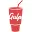   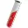 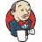    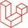 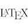   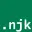  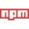 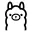  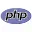        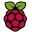            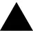  

🕒 **Last Update**

21-03-2025 14:11:40 UTC